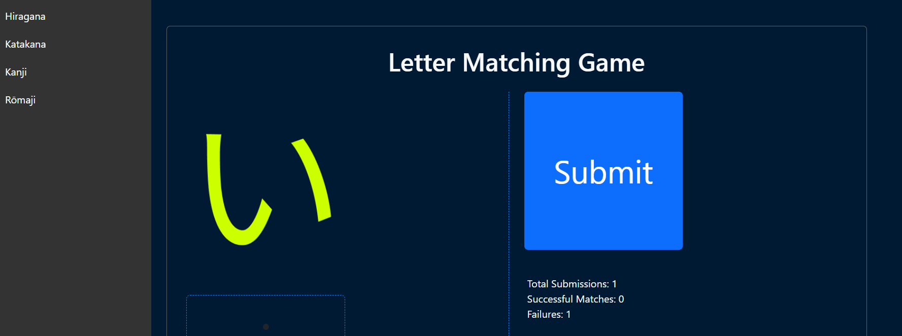
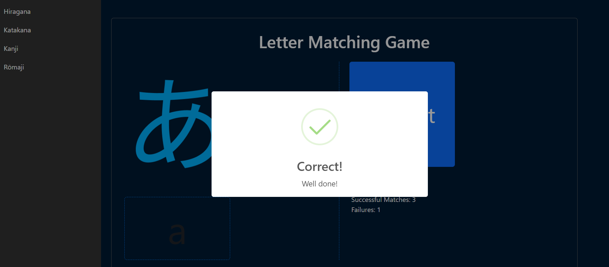

# Bangladesh Japanese Language Club - Letter Matching Game

The Letter Matching Game is a simple web-based game designed to help kids learn letters by matching them with their corresponding images. This game is built using HTML, CSS, JavaScript, and the Bootstrap framework.

## Features

- Match letters with their corresponding images.
- Interactive user interface.
- Responsive design for various screen sizes.
- Sound effects for correct and incorrect answers.
- Keep track of total submissions, successful matches, and failures.
- Easy navigation with a sidebar menu.

## Demo

You can play the demo of the Letter Matching Game [here](https://bjlc.vercel.app) (insert link to hosted demo if available).

## Screenshots




## Installation

1. Clone the repository:

```bash
   git clone https://github.com/jmrashed/bjlc-letter-matching-game.git
```
2. Open the index.html file in your web browser.


# Usage
Click on the letter input field and type the corresponding letter for the displayed image.
Click the "Submit" button to check if your answer is correct.
If correct, you'll see a success message and move to the next letter.
If incorrect, you'll see a failure message and can try again.
The game keeps track of your total submissions, successful matches, and failures.


# Contributing
Contributions are welcome! Feel free to fork the repository and submit pull requests to suggest improvements or new features.

# License
This project is licensed under the MIT License.

# Credits
- Sound effects obtained from SoundBible.
- Letter images sourced from Pixabay.

# Contact
For any inquiries or feedback, please contact at jmrashed@gmail.com.
Make sure to include relevant screenshots, installation instructions, usage guidelines, contribution guidelines, license information, credits, and contact details based on your project's specifics.

Join with the facebook group on  <a target="_blank" href="https://www.facebook.com/groups/japanlanguage.club">japanlanguage.club</a> to get started quickly response and support.


